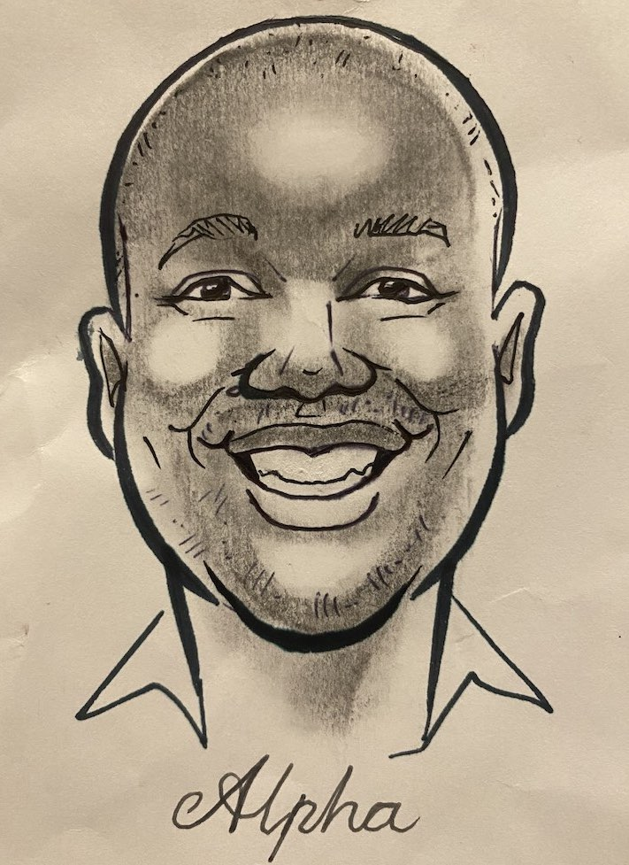

---
# Feel free to add content and custom Front Matter to this file.
# To modify the layout, see https://jekyllrb.com/docs/themes/#overriding-theme-defaults

layout: home
---
Welcome, fellow traveller!

I'm Alpha Shuro (yes, that's my real name). I, like you, am also a traveller, searching for a destination.

I enjoy learning, solving problems, learning how to learn, building software, and [building factories](https://www.factorio.com).
I'm also a fan of ice skating, and looking for more fun things to try.

## What I like to think about:

- **cognitive science**: how brains work and how to wield them effectively
- **philosophy**: meaningful ways to interpret reality and decide what actions to take
- **software engineering**: how do we work together to build functional, maintainable software?
- **pedagogy**: how do we make learning and knowledge-transfer more efficient?
- **life**: how to live it and enjoy it

## What I care deeply about

- I want to help humans live better (automate what should be automated, use tech for the good of the species)
- I want to help people learn how to learn and how to use their amazing pattern recognition machine (brain) well
- I always try to have a positive impact on the people around me (usually using bullet 2 👆🏿)